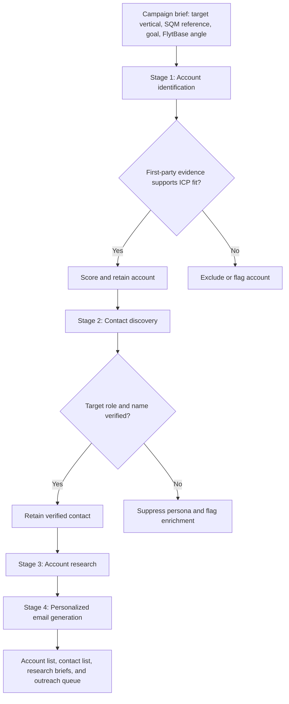

# Submission

## What I Built

Prospect Engine is an evidence-first outbound prospecting workflow for FlytBase's Latin American mining campaign. It accepts the campaign brief anchored on SQM and produces a prioritized account list, verified target contacts, source-backed account research, and personalized outbound drafts for Operations, HSE, and Site leadership.

The system is designed to prevent unsupported prospect data from reaching outreach. Each account shows its ICP rationale and public-source evidence. Contacts are retained only when a first-party company page verifies the person's role; otherwise the record is kept as an enrichment task and no email is generated.

## Architecture / Flow

## Why This Solves The Brief

The account model uses SQM's relevant operating context: large-scale Latin American mining, multi-site and high-consequence infrastructure, and hazardous or continuous operations where autonomous inspection is relevant. The workflow then connects each qualified account's current operating signals to FlytBase's autonomous drone inspection angle.

The outreach generator uses a verified contact's remit and the matched account's research signals rather than a generic mail-merge field. The rendered result includes the exact personalization inputs next to each generated email.

## Evidence From The Codebase

- `app.js` defines the account evidence, ICP scores, first-party source links, verified-contact records, suppression logic, and `emailFor` generation function.
- `index.html` and `styles.css` provide the brief input, staged workflow view, evidence review, contact details, outreach output, and JSON export action.
- `scripts/local-server.js` serves the project locally without dependencies.
- `thought-process.html` provides a standalone visual explanation of the workflow and its verification rules.

## Demo / Results

The deployed workflow completed all four stages and produced:

- 3 matched accounts: Vale, Nexa Resources, and Antofagasta Minerals.
- 4 verified named contacts: Carlos Medeiros, Rafael Bittar, Leonardo Nunes Coelho, and Fernando Demuner.
- 5 linked first-party public sources supporting the account research.
- 0 guessed email addresses.
- 1 intentional safe-failure record: Antofagasta Minerals remains a qualified account, while its Site Operations / HSE contact is marked `Needs enrichment` because no named target-role persona was verified from the available first-party sources.

The account cards show ICP scores of 94 for Vale, 91 for Nexa Resources, and 89 for Antofagasta Minerals. Verified contacts receive a generated outbound draft; the suppressed record does not.

## Notes And Limitations

The current implementation now runs as a live, input-driven research agent. It refreshes account evidence through Tavily and performs contact enrichment through Apollo when those environment variables are configured. The safe behavior remains the same: no inferred email addresses, invented people, or outreach draft for an unverified persona.

## Testing and transparency

- A local smoke harness is included as `test_research.js` that mocks provider responses and exercises the `api/research.js` handler. Run `node test_research.js` to validate behavior locally.
- For provider compatibility, long search queries are sanitized and truncated to avoid Tavily's 400-character query limit. The API response includes a `sanitizedQueries` array and the UI displays those sanitized queries under "Sanitized search queries" when results are returned.
