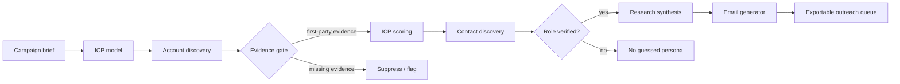

# Prospect Engine: Workflow Design

## Decision logic

1. Model the target from SQM: large LATAM mining, multi-site footprint, hazardous extraction or processing, and operations/HSE/site leadership as buying roles.
2. Score candidate accounts on commodity and geography, operating scale, operational complexity, safety/inspection relevance, and a current public signal.
3. Treat first-party company publications as the evidence baseline. Search results are discovery leads, not sufficient proof.
4. Only surface named contacts when their role is verifiable on a company-owned leadership page. Do not infer email addresses.
5. Generate outreach from the matched account's cited facts and the contact's verified remit. The app displays the exact inputs alongside every draft.

## Failure handling

The Antofagasta record demonstrates the intended safe failure state: strong account evidence but no named target-role contact verified by the cached first-party sources. The pipeline keeps the account, suppresses the persona and does not create a speculative email. The next production step is a licensed enrichment provider or additional public-source verification, followed by a repeat run.
