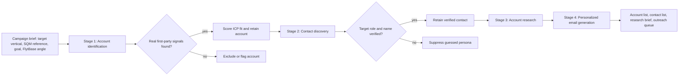

# Prospect Engine: Workflow Design

## Decision logic

1. The campaign brief models SQM's ICP: large LATAM mining, multi-site footprint, hazardous extraction or processing, and Operations/HSE/Site leadership as buying roles.
2. Stage 1 identifies and scores accounts using commodity and geography, operating scale, operational complexity, safety/inspection relevance, and a current public signal.
3. Stage 2 finds target contacts and retains them only when their role is verifiable on a company-owned leadership page. Email addresses are never inferred.
4. Stage 3 synthesizes recent news, operating footprint, and technical or safety signals from first-party company publications.
5. Stage 4 generates outreach from cited account facts and the contact's verified remit. The app shows the exact inputs alongside every draft.

## Failure handling

The Antofagasta record demonstrates the intended safe failure state: strong account evidence but no named target-role contact verified by the cached first-party sources. The pipeline keeps the account, suppresses the persona and does not create a speculative email. The next production step is a licensed enrichment provider or additional public-source verification, followed by a repeat run.
